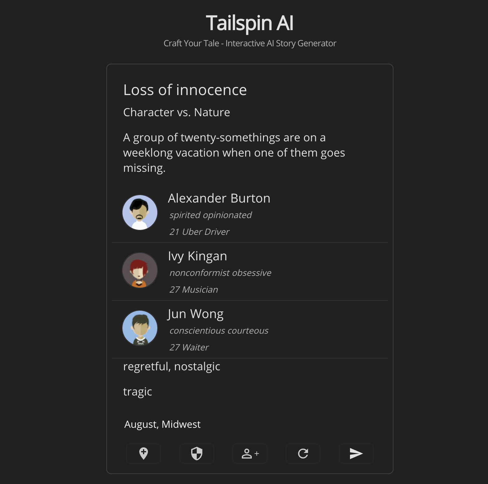

# Tailspin Client

## Tailspin: Craft Your Tale - Interactive AI Story Generator

Tailspin is an interactive web application designed to unleash your creativity in storytelling. Leveraging the power of AI, Tailspin enables users to generate unique story outlines that can be further developed into full-fledged narratives.



```markdown
The midwestern sun blazed down on the small cabin where Alexander, Ivy, and Jun were staying for their weeklong vacation. The air was thick with the scent of corn and the distant sound of cattle could be heard. It was August, the peak of summer, and the perfect time to escape the city and all of its craziness.

Alexander, a spirited young man with a head full of opinions, was lounging in a hammock, sipping on a cold beer. Ivy, a nonconformist musician, was sprawled on the grass, strumming her guitar. Jun, the polite and conscientious waiter, was busy tending to the BBQ, his apron stained with sauce.

They had been friends since college and had promised to take a trip together every summer. This year, they had decided on the Midwest, craving the simplicity and peace that it offered.

As the sun began to set, they gathered around the fire, roasting marshmallows and sharing stories. The fireflies danced around them, adding to the magical atmosphere. Everything seemed perfect, until Alexander's phone rang ...
```

### Features

- **Interactive Story Elements**: Click to modify elements of your story including characters, settings, and plot points.
- **AI-Powered Story Generation**: Integrates with an AI backend to transform your outline into a captivating story.
- **Customizable Experience**: Offers a range of tones and endings to choose from, making each story unique.

### Getting Started

To get started with Tailspin, clone this repository and install its dependencies:

```bash
git clone https://github.com/yourusername/tailspin-client.git
cd tailspin-client
npm install
```

To run Tailspin locally:

```bash
npm start
```

This will start the application on localhost:3000 (or your default React port).

## Building for Production

To build the application for production:

```bash
npm run build
```

This will create a build folder with a production build of the application.

## Dependencies

- React
- React-DOM
- Styled-Components
- React Loader Spinner
- Testing Libraries (Jest-DOM, React Testing Library)

## Contributing

Contributions to Tailspin are welcome! Whether it's submitting a bug, proposing new features, or improving documentation, your input is highly appreciated.

- Fork the repository.
- Create a new branch with a descriptive name.
- Make your changes.
- Submit a pull request.

## License

Tailspin is open-source software licensed under the GPL-3.0-or-later license.
