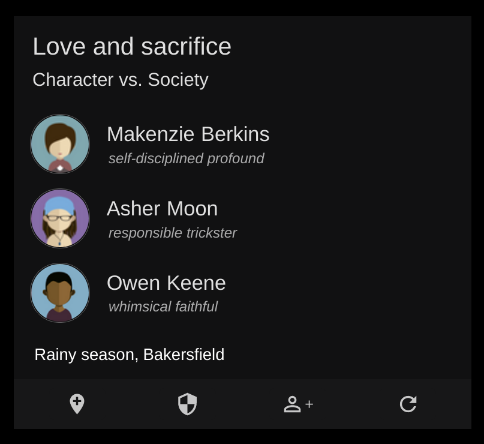

# Genstar

A tool to creates plots by generating an outline and allowing users to tweak the details. Useful as a writing prompt or idea generator.

The app generates changeable story properties including:

-   Themes ("Love and sacrifice")
-   conflict types ("Character vs. Society")
-   Character First and Last Name ("Asher Moon")
-   Character description ("whimsical", "faithful")
-   Time ("Autumn")
-   Location ("Bakersfield")
-   Character Gravatar



## Demo

[stringtalk.org/genstart](https://stringtalk.org/genstar)

## API

```

const getRandomConflicts = ({ number = 1, current = [] }) =>
  randomItems(conflicts, number, current);

const getRandomGivens = ({ number = 1, current = [] }) =>
  randomItems(givenNames, number, current);

const getRandomFamilies = ({ number = 1, current = [] }) =>
  randomItems(familyNames, number, current);

const getRandomAllWords = ({ number = 1, current = [] }) =>
  randomItems(allWords, number, current);

const getRandomLocations = ({ number = 1, current = [] }) =>
  randomItems(locations, number, current);

const getRandomThemes = ({ number = 1, current = [] }) =>
  randomItems(themes, number, current);

const getRandomTimes = ({ number = 1, current = [] }) =>
  randomItems(times, number, current)

const createProfileUrl = (path) =>
  `${path}/images/${randomInt()}.png`;

```

## Contributing

To suggest additions or subtractions to any of Genstar's features, please open an issue in the github repository (https://github.com:ktleary/genstar)

## Acknowledgements

#### Avatar Image Credits

[People vector designed by Skydesign - Freepik.com](http://www.freepik.com/free-photos-vectors/people).

## Licence

GPL-3.0-or-later

## Installation

-   git clone
-   npm install
-   npm start

## Test

-   npm test
