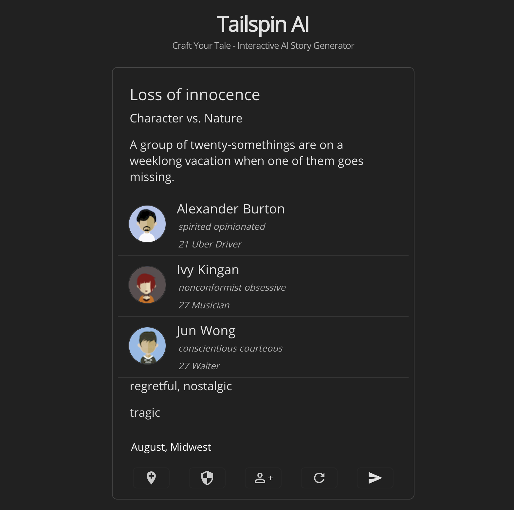

# Tailspin Client

## Tailspin: Craft Your Tale — Interactive AI Story Generator

Tailspin is an interactive web app that turns a click-assembled outline into a short story. Live at [tailspin.fun](https://tailspin.fun/).



## Architecture

1. **User selections** — theme, characters, tone, ending, setting, and plot point come from curated pools in `src/Genstar/data/`.
2. On each “next suggestion” click the client POSTs the partial story plus a candidate pool to **`/api/v1/rank-suggestions`**. One Jev call scores candidates for coherence with the outline and the API samples top-k from that distribution (not just #1).
3. The user picks from those ranked suggestions.
4. **`POST /api/v1/create-story`** sends the full outline; the backend generates ~800 words under tone-matched style guidance.

If ranking is unavailable, the client keeps the **legacy random path**. The API signals that with `degraded: true`.

## Data curation

Suggestion pools were editorially curated (Sept 2026) against literary-craft sources: Tobias’s *20 Master Plots* (plot points mapped to all 20 shapes), Freytag’s pyramid, and five-elements storytelling. Names went from 1,411 → 397; modern/AI themes were added; settings taxonomy drift was fixed. TypeSafe Jev coherence checks: mean 2.19/3, zero clashing configs.

## Features

- Click any element to reroll it (Jev-ranked when the API is up).
- AI-backed full-story generation from the outline.
- Tones and endings as first-class constraints, not decorations.

## Getting Started

```bash
git clone https://github.com/ktleary/tailspin-client.git
cd tailspin-client
npm install
npm start
```

Runs on localhost:3000. Point the API at `http://localhost:8080` (see `src/Genstar/components/story.js`).

```bash
npm run build
```

## License

GPL-3.0-or-later.
